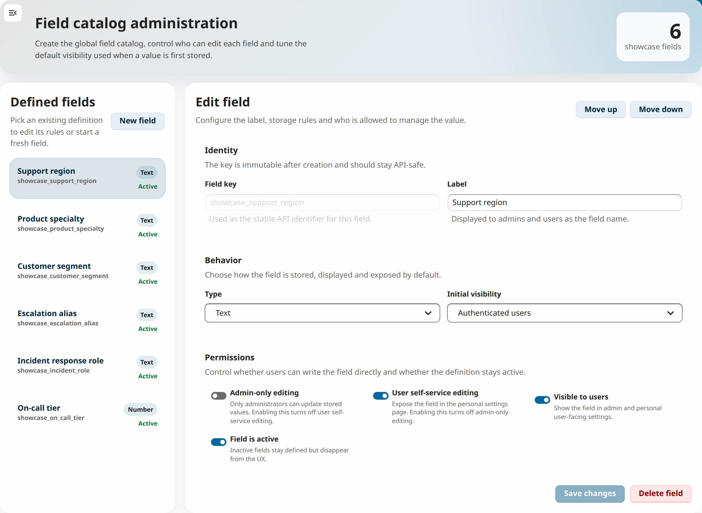

<!--
SPDX-FileCopyrightText: 2026 LibreCode coop and LibreCode contributors
SPDX-License-Identifier: AGPL-3.0-or-later
-->

# Profile fields

Turn Nextcloud accounts into a structured directory for real operational work.

Profile fields lets teams add organization-specific profile data that does not fit in the default Nextcloud profile, with clear governance over who can edit each field and who can see it.

- Model support regions, customer segments, escalation aliases, incident roles and other business-specific profile data.
- Combine self-service updates with admin-managed fields for sensitive operational context.
- Surface the same custom data in personal settings, admin catalog management and user administration workflows.

This makes the app useful for internal directories, support operations, partner programs and other corporate deployments that need richer account metadata without leaving Nextcloud.

## Screenshots

