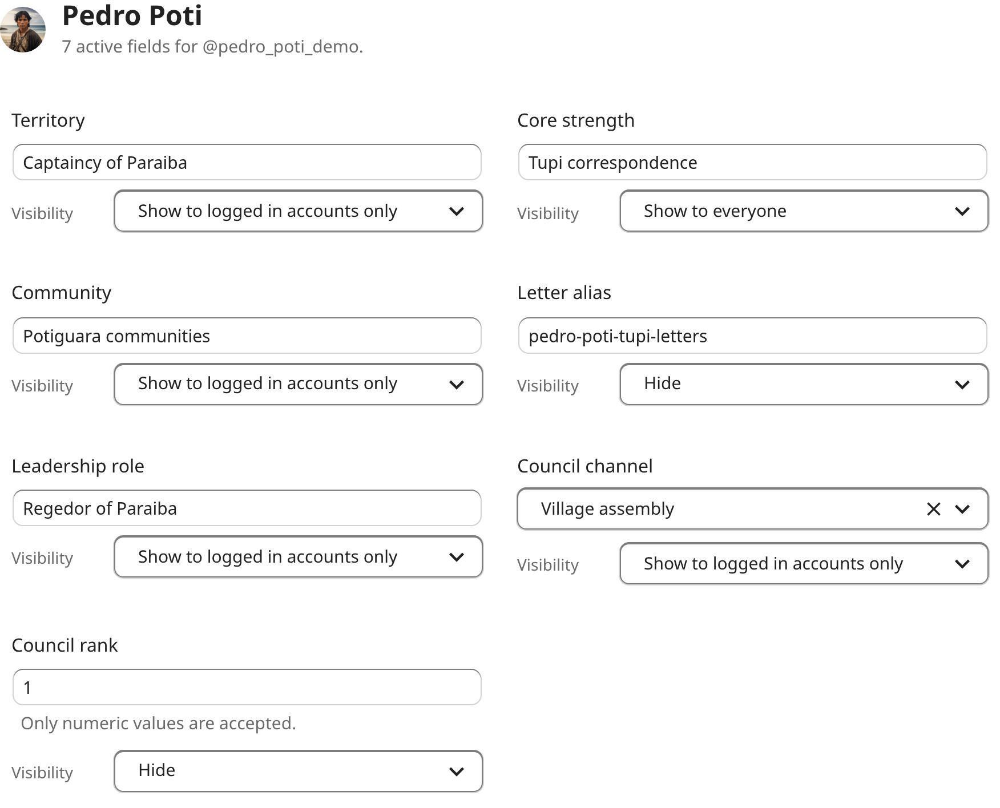
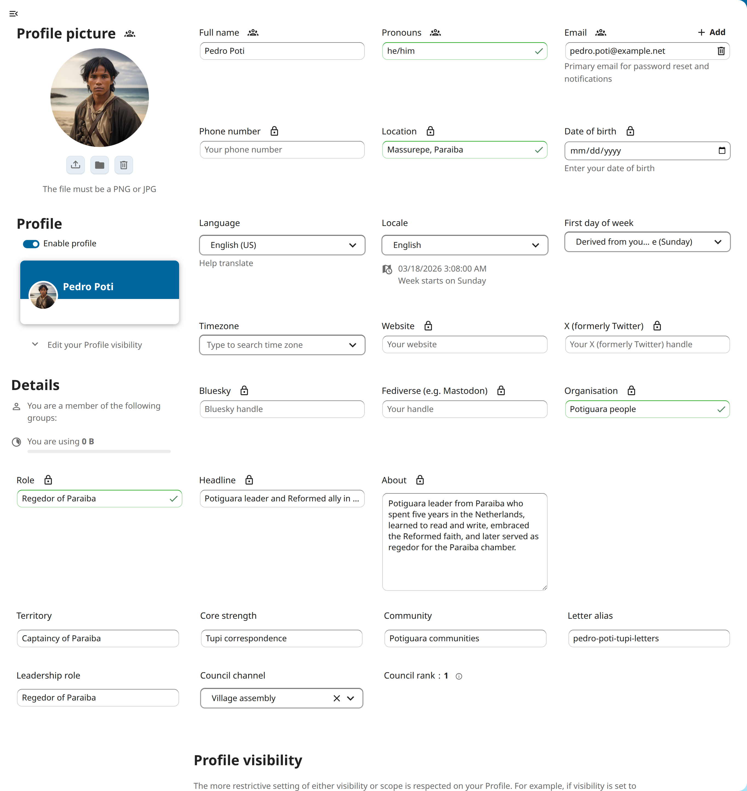
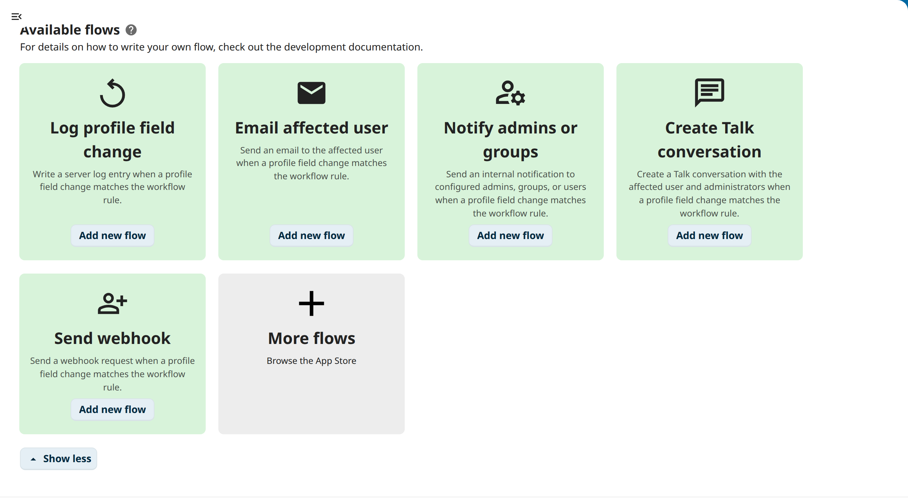

<!--
SPDX-FileCopyrightText: 2026 LibreCode coop and LibreCode contributors
SPDX-License-Identifier: AGPL-3.0-or-later
-->

# Profile fields

Turn Nextcloud accounts into a structured directory for real operational work.

Profile fields lets teams add organization-specific profile data that does not fit in the default Nextcloud profile, with clear governance over who can edit each field and who can see it.

- Model support regions, customer segments, escalation aliases, incident roles and other business-specific profile data.
- Combine self-service updates with admin-managed fields for sensitive operational context.
- Surface the same custom data in personal settings, admin catalog management and user administration workflows.

This makes the app useful for internal directories, support operations, partner programs and other corporate deployments that need richer account metadata without leaving Nextcloud.

## Features

- Central field catalog for organization-specific profile data.
- Per-field governance for admin-managed and self-service updates.
- Per-value visibility controls for public, authenticated-user, and private exposure.
- User administration tools for reviewing and updating profile field values.
- Workflow integration based on custom profile metadata.
- Global search results built only from fields and values exposed to the current user.

## API documentation

The public API contract for this app is published as [openapi-full.json](https://github.com/LibreCodeCoop/profile_fields/blob/main/openapi-full.json).

## Data backup and import

Run the app commands from the Nextcloud stack root, not from the host PHP environment.

| occ Command | Description |
| --- | --- |
| `profile_fields:data:export` | Export the current Profile Fields catalog and stored values. |
| `profile_fields:data:import` | Validate an import payload without writing anything. |
| `profile_fields:data:import` | Apply the non-destructive `upsert` import. |
| `profile_fields:data:clear` | Clear app definitions explicitly before reimporting into the same environment. |

## Screenshots

### Admin catalog

### User management dialog

### Personal settings

### Workflow automation

